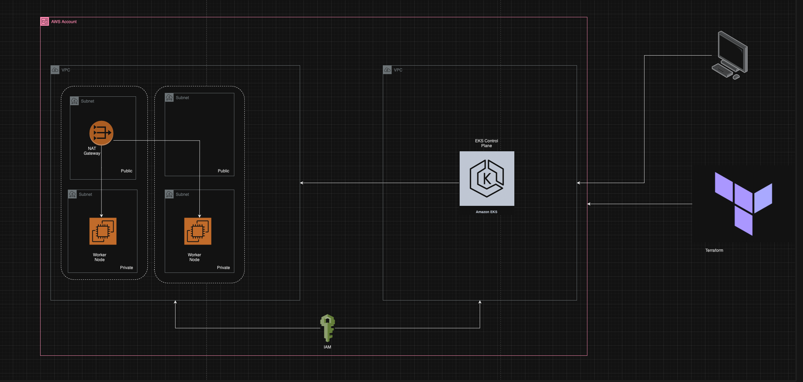

## Introduction

This Terraform project focuses on the deployment and management of an AWS EKS cluster. Our aim is to facilitate a scalable and efficient Kubernetes environment, taking advantage of AWS's robust cloud offerings.



## Tools & Services Used

### Infrastructure as Code:

- **Terraform**: Used to provision and manage AWS resources.

### AWS Services:

- **EKS**: Amazon Elastic Kubernetes Service for Kubernetes management.
- **VPC**: Virtual Private Cloud for isolating your EKS resources.
- **IAM**: Managing permissions and roles for EKS and worker nodes.
- **S3**: Storing Terraform state.
- **DynamoDB**: Handling Terraform state lock to prevent state conflicts.

## Prerequisites

Ensure the following components are installed and properly configured:

- Terraform
- AWS CLI (configured with default region as `us-west-1` and AWS credentials with necessary access rights)

The project utilizes the default VPC in the `us-west-1` region, making use of multiple subnets across availability zones such as:

- us-west-1a
- us-west-1b
- us-west-1c

For SSH access, ensure you have an existing key pair in the AWS `us-west-1` region.

## Project Architecture

The deployment strategy focuses on a modular approach, with different components being managed by their respective Terraform modules. Here's a breakdown of the primary components:

- **VPC**: Setting up a VPC with necessary subnets and networking components for the EKS cluster.
- **EKS Cluster**: Provisions the Kubernetes cluster and its associated worker nodes.

## Project File Structure
```
.
├── terraform
│   ├── modules
│   ├── eks_cluster
│   │   ├── eks_cluster.tf
│   │   ├── eks_nodes.tf
│   │   ├── outputs.tf
│   │   └── variables.tf
│   │
│   ├── vpc
│   │   ├── data_sources.tf
│   │   ├── main.tf
│   │   ├── outputs.tf
│   │   └── variables.tf
│   │
│   ├── terraform.lock.hcl
│   ├── backend.tf
│   ├── main.tf
│   ├── providers.tf
│   └── variables.tf
│
├── README.md
└── terraform.tfvars
```


## Usage

1. Navigate to the root directory of the project.
2. Initialize the Terraform directory with `terraform init`.
3. Review the planned changes with `terraform plan`.
4. Apply the desired changes with `terraform apply`.

## Note

* Be aware of AWS pricing details. Ensure you de-provision any resources not in use to avoid unexpected costs.
* After testing or learning, remember to destroy any created resources using `terraform destroy` to avoid incurring extra charges.
